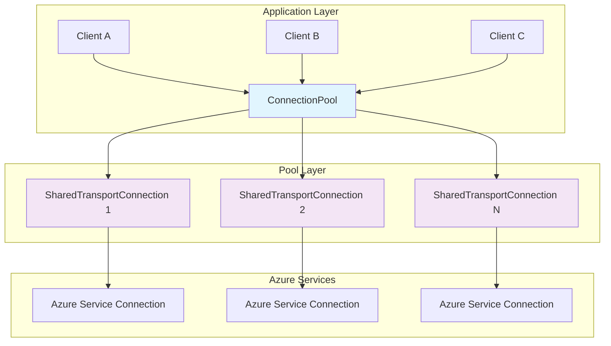
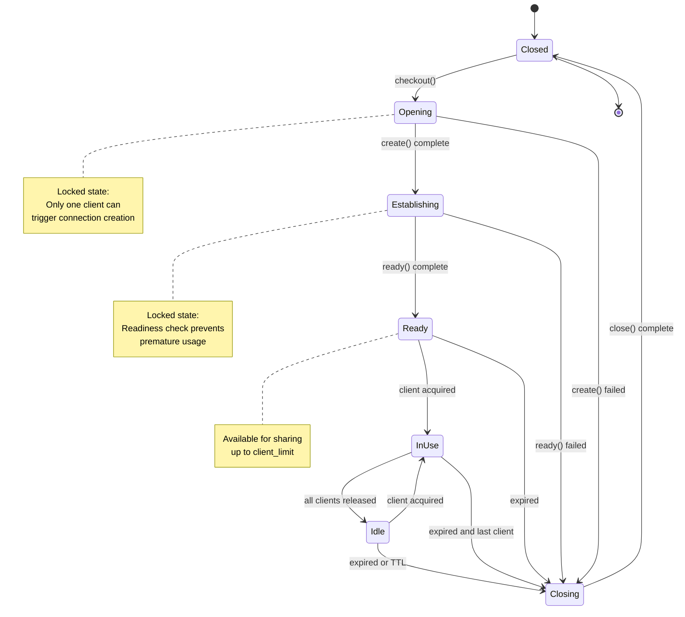
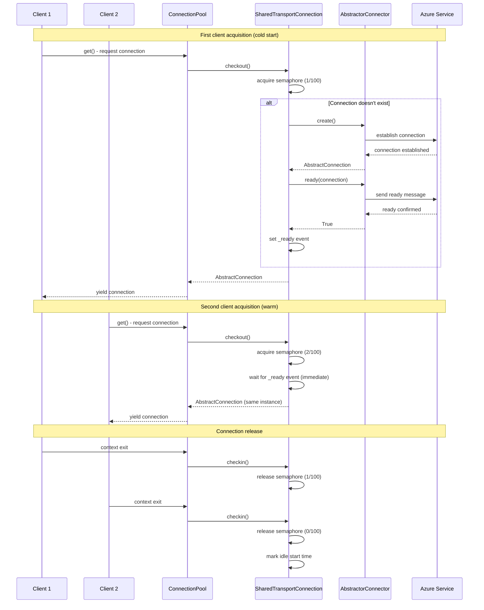
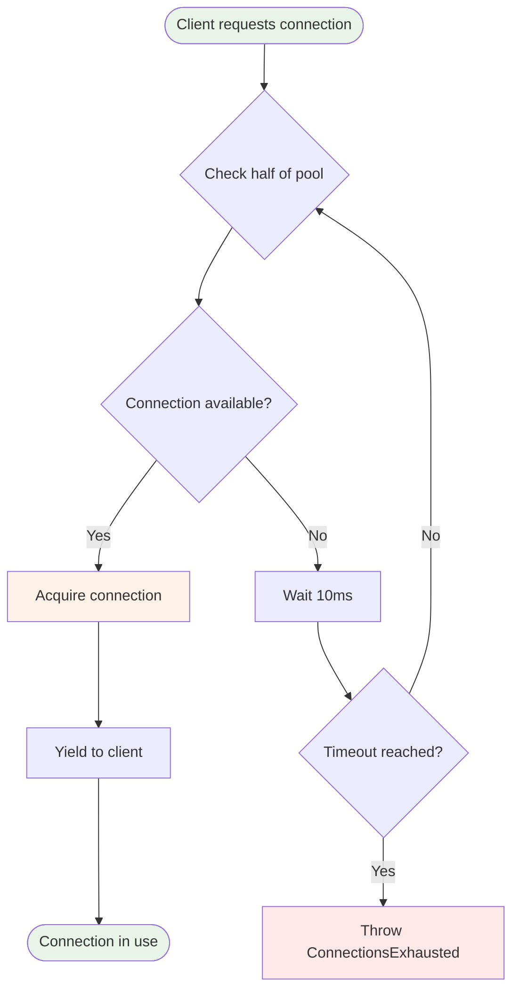

# Connection Pooling

The primary contribution of this library is its connection-pooling system that reduces the time required to *establish connections* through shared, persistent connections.

## Problem Statement

Azure SDK clients face several challenges:

- **Connection Overhead**: Each new connection requires TLS handshake, authentication, and service negotiation
- **Idle Timeouts**: Azure services aggressively close idle connections
- **Resource Limits**: Services impose per-client connection limits
- **Concurrency Issues**: Thread-safety and async-safety concerns with shared connections

## Solution Architecture

Our connection pooling system implements a three-tier architecture that addresses these challenges:



## Connection Lifecycle States

Each `SharedTransportConnection` transitions through distinct states:



## Sequence Diagram: Connection Acquisition



## Core Components Deep Dive

### AbstractorConnector Interface

The connector interface abstracts Azure service-specific connection logic:

```python
class AbstractorConnector(ABC):
    @abstractmethod
    async def create(self) -> AbstractConnection:
        """Create a new Azure service connection"""

    @abstractmethod
    async def ready(self, connection: AbstractConnection) -> bool:
        """Validate connection is ready for use"""
```

**Implementation Pattern**:
```python
class ManagedCosmosConnector(AbstractorConnector):
    async def create(self) -> ContainerProxy:
        # Create Cosmos client and get container
        return container_proxy

    async def ready(self, container: ContainerProxy) -> bool:
        # Send test query to validate readiness
        await container.read_item("__health__", "__health__")
        return True
```

### SharedTransportConnection

Implements the core pooling logic with several critical features:

#### Client Limiting via Semaphore

```python
# Each connection allows up to client_limit concurrent users
self.client_limiter = anyio.CapacityLimiter(total_tokens=client_limit)

async def checkout(self):
    await self.client_limiter.acquire()  # Block if limit reached
    # ... connection logic

async def checkin(self):
    self.client_limiter.release()  # Free up slot
```

#### Expiration Management

Connections expire based on two criteria:

```python
@property
def expired(self) -> bool:
    # Idle timeout
    idle_expired = self.time_spent_idle > self.max_idle_ns

    # Lifetime timeout
    lifetime_expired = (
        self.max_lifespan_ns and
        self.lifetime > self.max_lifespan_ns
    )

    return idle_expired or lifetime_expired
```

#### Critical Section Locking

Three operations require exclusive access:

```python
# Opening: Only one client can create the connection
async def create(self):
    async with self._open_close_lock:
        if not self._connection:
            self._connection = await self._connector.create()

# Readiness: Only one client can perform readiness check
async def check_readiness(self):
    async with self._open_close_lock:
        if not self._ready.is_set():
            await self._connector.ready(self._connection)
            self._ready.set()

# Closing: Only one client can close the connection
async def close(self):
    async with self._open_close_lock:
        await self._connection.close()
        self._connection = None
```

### ConnectionPool

Manages a heap of `SharedTransportConnection` instances:

#### Load Balancing Algorithm

```python
# Use min-heap to select connection with:
# 1. Fewest active clients
# 2. Longest idle time (for ties)

def __lt__(self, other):
    if self.current_client_count == other.current_client_count:
        return self.time_spent_idle > other.time_spent_idle
    return self.current_client_count < other.current_client_count
```

#### Connection Selection Process



## Performance Characteristics

### Connection Reuse Efficiency

- **Cold Start**: ~100-900ms (TLS + auth + ready check)
- **Warm Reuse**: ~1-5ms (semaphore acquisition only)
- **Improvement**: 100-500x faster for subsequent requests

### Memory Footprint

- **Per Connection**: ~50-100KB (Azure client overhead)
- **Per Pool**: `max_size * connection_overhead`
- **Shared State**: Minimal additional overhead

### Concurrency Scaling


```
Theoretical Max Concurrent Operations = max_size × client_limit
Default Configuration = 10 × 100 = 1,000 concurrent operations
```

!!! note "Defaults"

    It's possible to allow more than **100 concurrent client requests** and **10 connections** in a pool. These are configurable defaults.


## Configuration Parameters

### Core Settings

| Parameter | Default | Purpose | Tuning Guidelines |
|-----------|---------|---------|-------------------|
| `client_limit` | 100 | Concurrent clients per connection | 50-75 (low latency), 100-200 (high throughput) |
| `max_size` | 10 | Number of connections in pool | 2-5 (small), 5-15 (medium), 15-50 (large apps) |
| `max_idle_seconds` | 300 | Idle timeout before recycling | 60-300 (frequent), 600-1800 (infrequent) |
| `max_lifespan_seconds` | None | Maximum connection lifetime | 1800-7200 (recommended) |
| `pool_connection_create_timeout` | 10 | Timeout for creating pool connections | 5-30 seconds based on network latency |
| `pool_get_timeout` | 60 | Timeout for acquiring pool connections | 30-120 seconds based on load patterns |

### Configuration Examples

!!! warning "Azure idle-sockets termination"

    Azure will aggressively close **idle sockets**. We have found via heuristics for different services that the idle durations are between 2 minutes and 5 minutes (for various services).

    We recommend closing **idle connections** before 1-2 minutes!


```python

# High-throughput configuration
client = ManagedCosmos(
    # ... connection details
    client_limit=200,        # More concurrent clients
    max_size=20,             # Larger pool
    max_idle_seconds=600,    # Longer retention
    max_lifespan_seconds=7200,  # 2-hour rotation
    pool_connection_create_timeout=30,  # Allow more time for creation
    pool_get_timeout=120     # Extended acquisition timeout
)

# Low-latency configuration
client = ManagedCosmos(
    # ... connection details
    client_limit=50,         # Reduced contention
    max_size=5,              # Smaller pool
    max_idle_seconds=60,     # Quick recycling
    max_lifespan_seconds=1800,  # 30-minute rotation
    pool_connection_create_timeout=5,   # Fast creation timeout
    pool_get_timeout=30      # Quick acquisition timeout
)

# Memory-optimized configuration
client = ManagedCosmos(
    # ... connection details
    client_limit=25,         # Conservative limit
    max_size=3,              # Minimal pool
    max_idle_seconds=30,     # Aggressive recycling
    max_lifespan_seconds=600,   # 10-minute rotation
    pool_connection_create_timeout=10,  # Default creation timeout
    pool_get_timeout=60      # Default acquisition timeout
)
```

## Implementation Details

### Thread Safety and Async Safety

The pooling system is designed for high-concurrency, async environments:

```python
# Semaphore-based client limiting (async-safe)
self.client_limiter = anyio.CapacityLimiter(total_tokens=client_limit)

# Lock-free connection selection using heap
for conn in heapq.nsmallest(conn_check_n, self._pool):
    if conn.available:
        # Attempt acquisition without pool-level locking

# Critical sections use connection-level locks only
async with connection._open_close_lock:
    # Only lock individual connections, not entire pool
```

### Performance Optimizations

#### Heap-Based Connection Selection

```python
# O(log n) selection of optimal connection
# Connections are ordered by:
# 1. Number of active clients (ascending)
# 2. Idle time (descending, for ties)

def __lt__(self, other):
    if self.current_client_count == other.current_client_count:
        return self.time_spent_idle > other.time_spent_idle
    return self.current_client_count < other.current_client_count
```

#### Lazy Connection Creation

```python
# Connections created only when needed
if not self._connection:
    self._connection = await self.create()
    await self.check_readiness()
```

#### Efficient Idle Detection

```python
# Idle time tracked per connection
if self.current_client_count == 0:
    self.last_idle_start = time.monotonic_ns()

# Nanosecond precision for accurate timeouts
@property
def time_spent_idle(self) -> int:
    if self.last_idle_start is None:
        return 0
    return time.monotonic_ns() - self.last_idle_start
```

## Advanced Usage Patterns

### Custom Connector Implementation

```python
class CustomAzureConnector(AbstractorConnector):
    def __init__(self, service_config):
        self.config = service_config

    async def create(self) -> CustomAzureClient:
        # Implement service-specific connection logic
        client = CustomAzureClient(
            endpoint=self.config.endpoint,
            credential=self.config.credential
        )
        await client.initialize()
        return client

    async def ready(self, client: CustomAzureClient) -> bool:
        # Implement readiness check
        try:
            await client.health_check()
            return True
        except Exception:
            return False

# Use with connection pool
pool = ConnectionPool(
    connector=CustomAzureConnector(config),
    client_limit=100,
    max_size=10
)
```

### Pool Health Monitoring

```python
def analyze_pool_health(pool: ConnectionPool):
    """Analyze connection pool performance."""
    connections = pool._pool

    metrics = {
        "total_connections": len(connections),
        "ready_connections": sum(1 for c in connections if c.is_ready),
        "active_connections": sum(1 for c in connections if c.current_client_count > 0),
        "average_clients_per_connection": sum(c.current_client_count for c in connections) / len(connections),
        "idle_connections": sum(1 for c in connections if c.current_client_count == 0 and c.is_ready)
    }

    return metrics

# Monitor pool
metrics = analyze_pool_health(cosmos_client.pool)
print(f"Pool utilization: {metrics['active_connections']}/{metrics['total_connections']}")
```

### Error Recovery Patterns

```python
async def resilient_operation(pool: ConnectionPool, operation_func):
    """Execute operation with automatic connection recovery."""
    max_retries = 3

    for attempt in range(max_retries):
        try:
            async with pool.get() as connection:
                return await operation_func(connection)

        except (ConnectionError, OSError) as e:
            if attempt == max_retries - 1:
                raise

            # Force connection cleanup and retry
            await pool.expire_conn(connection)
            await asyncio.sleep(2 ** attempt)  # Exponential backoff
```

## Troubleshooting

### Common Issues

#### ConnectionsExhausted Error

```python
# Symptoms: "No connections available" error
# Causes: Pool too small or client_limit too low

# Solutions:
client = ManagedCosmos(
    # ... other params
    client_limit=200,  # Increase from 100
    max_size=20,       # Increase from 10
)
```

#### High Memory Usage

```python
# Symptoms: Gradual memory increase
# Causes: Too many connections or long lifespans

# Solutions:
client = ManagedCosmos(
    # ... other params
    max_size=5,              # Reduce pool size
    max_idle_seconds=60,     # Aggressive recycling
    max_lifespan_seconds=600 # Short lifespans
)
```

#### Slow Connection Acquisition

```python
# Symptoms: High latency on pool.get()
# Causes: Lock contention or expired connections

# Solutions:
client = ManagedCosmos(
    # ... other params
    client_limit=50,     # Reduce contention
    max_idle_seconds=30  # Prevent expiration
)
```

### Debug Monitoring

```python
import logging

# Enable detailed pool logging
logging.getLogger("aio_azure_clients_toolbox.connection_pooling").setLevel(logging.DEBUG)

# Monitor connection lifecycle
async def log_pool_operations(pool):
    while True:
        for i, conn in enumerate(pool._pool):
            logger.info(f"Connection {i}: "
                       f"clients={conn.current_client_count}, "
                       f"ready={conn.is_ready}, "
                       f"idle_time={conn.time_spent_idle/1e9:.1f}s")
        await asyncio.sleep(10)
```

## Comparison with Direct Azure SDK Usage

| Aspect | Direct Azure SDK | Connection Pooling |
|--------|------------------|-------------------|
| **Connection Time** | 100-500ms per operation | 1-5ms after warmup |
| **Memory Usage** | High (new client per operation) | Low (shared connections) |
| **Concurrency** | Limited by client creation overhead | High (up to client_limit × max_size) |
| **Error Handling** | Manual connection management | Automatic recovery and recycling |
| **Resource Efficiency** | Poor (frequent connect/disconnect) | Excellent (persistent connections) |

## Design Principles

1. **Async-First**: Built for asyncio with proper async context managers
2. **Lock-Free Where Possible**: Minimize lock contention through design
3. **Fail-Fast**: Quick error detection and recovery
4. **Observable**: Rich debugging and monitoring capabilities
5. **Configurable**: Tunable for different workload patterns
6. **Azure-Optimized**: Designed around Azure SDK patterns and limitations