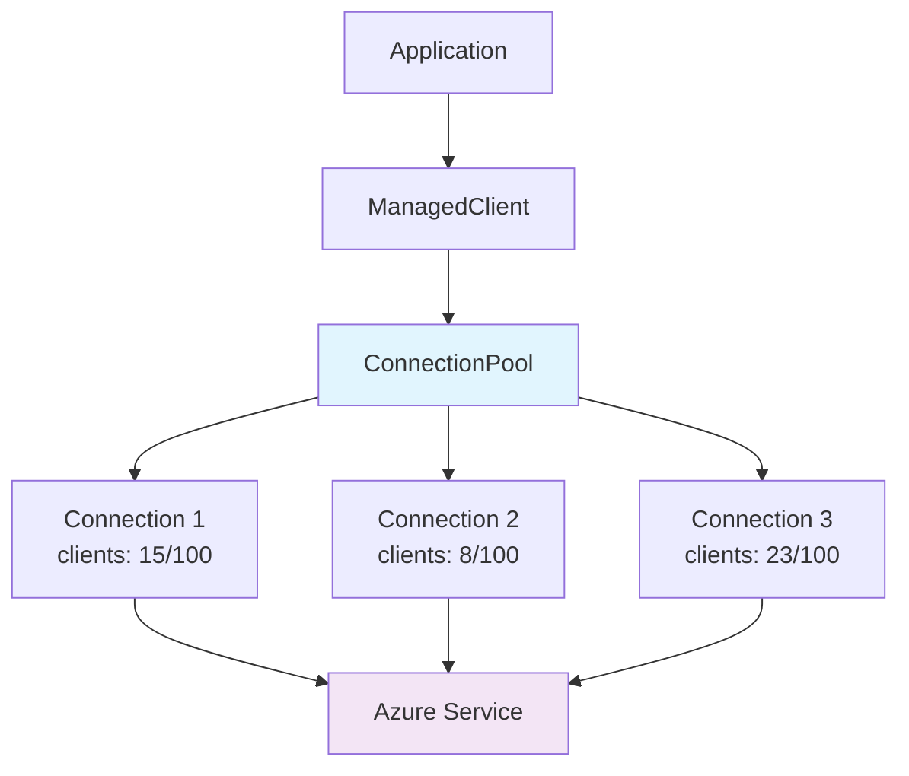

# AIO Azure Clients Toolbox

Async Python library for Azure SDK clients with connection pooling.

## Connection Pooling Benefits

Following the async Python examples from the Azure SDK for services such as `Eventhub` and `ServiceBus` usage creates a new connection for each operation.

!!! warning "Typical connection costs"

    In our traces, we found that **creating** a connection in order to publish to `Eventhub` or `ServiceBus` adds **700ms-900** ms to each request! On the other hand, *actually publishing* messages typically takes **microseconds**. When we asked Azure about this directly, they told us these latencies were not improvable, and exist all across all language SDKs.

!!! info "Connection-pooling benefits"
    This library eliminates the typical connection overhead through persistent connections in a connection pool. This amortizes that initial connection cost over subsequent requests.


Each connection is established upon first usage, and we fire a `ready()` message in order to make sure the connection _is_ established. After that it will live until its TTL is met.

```python
# Traditional approach - slow
cosmos_client = CosmosClient(endpoint, credential)
container = cosmos_client.get_database("db").get_container("container")
await container.create_item({"id": "1"})  # 200ms+ including connection setup

# Connection pooled approach - fast
cosmos_client = ManagedCosmos(endpoint, "db", "container", credential)
async with cosmos_client.get_container_client() as container:
    await container.create_item({"id": "1"})  # 2ms after pool warmup; connection client remains alive for TTL duration
```

## The `SharedTransportConnection` class

This library's `SharedTransportConnection` pattern allows multiple Azure SDK clients to safely share a single underlying connection:

- **Semaphore-based client limiting**: Controls concurrent operations per connection.
- **Heap-optimized connection selection**: O(log n) selection of optimal connections.
- **Automatic lifecycle management**: Handles connection expiration and renewal.
- **Lock-free design**: Minimizes contention in high-concurrency scenarios.
- **Critical-sections locking**: Some locking is still required, when opening, closing, and establishing connection-readiness.

## Performance Table

| Metric | Direct Azure SDK | Connection Pooling | Improvement |
|--------|------------------|-------------------|-------------|
| **Connection Time** | 100-900ms per operation | 1-5ms after warmup | **20-100x faster** |
| **Concurrency** | Limited by connection overhead | Up to `client_limit × pool_size` | **10-50x higher** |
| **Resource Efficiency** | Poor (connect/disconnect cycles) | Improved (persistent connections) | ... |

## Supported Azure Services

All clients have basic wrappers but **some** offer "managed" (connection-pooled) versions. This table shows the basic and managed clients available:

| Service | Basic Client | Managed Client |
|---------|--------------|----------------|
| **Cosmos DB** | `Cosmos` | `ManagedCosmos` |
| **Event Hub** | `Eventhub` | `ManagedAzureEventhubProducer` |
| **Service Bus** | `AzureServiceBus` | `ManagedAzureServiceBusSender`
| **Blob Storage** | `AzureBlobStorageClient` | N/A |
| **Event Grid** | `EventGridClient` | N/A |

## Quick Start

```bash
pip install aio-azure-clients-toolbox
```

```python
from azure.identity.aio import DefaultAzureCredential
from aio_azure_clients_toolbox import ManagedCosmos

# Connection pooling enabled by default
cosmos_client = ManagedCosmos(
    endpoint="https://your-cosmos.documents.azure.com:443/",
    dbname="your-database",
    container_name="your-container",
    credential_factory=lambda: DefaultAzureCredential(),

    # Pool configuration
    client_limit=100,      # Concurrent clients per connection
    max_size=10,           # Maximum connections in pool
    max_idle_seconds=300   # Connection idle timeout
)
# Use the pooled connection
async with cosmos_client.get_container_client() as container:
    # Fast operations after initial connection setup
    result = await container.create_item(body={"id": "1", "data": "example"})
```

## Connection Pooling Architecture

The library implements a connection pooling system optimized for Azure services:



Key components:

- **Connection Pool**: Manages multiple persistent connections using a binary heap for optimal selection
- **Client Limiting**: Semaphore-based control (typically 100 concurrent clients per connection)
- **Lifecycle Management**: Automatic connection creation, expiration, and cleanup
- **Error Recovery**: Failed connections are automatically recycled

## When to Use Connection Pooling

**Ideal for:**

- High-frequency operations (>10 requests/minute)
- Concurrent workloads with multiple async tasks
- Long-running applications and services
- Performance-critical applications

**Consider alternatives for:**

- One-off scripts with single operations
- Very low-frequency usage (<1 request/hour)
- Applications with strict memory constraints

## Advanced Features

- **Testing Utilities**: Comprehensive pytest fixtures for mocking Azure services
- **Custom Connectors**: Extensible framework for additional Azure services
- **Health Monitoring**: Built-in connection health checks and metrics
- **Configurable Timeouts**: Fine-tune connection behavior for your workload

## Next Steps

- **[Connection Pooling Guide](connection-pooling.md)** - Deep dive into the pooling system with technical diagrams
- **[Installation](installation.md)** - Setup and dependencies
- **[Client Documentation](clients/cosmos.md)** - Service-specific usage guides
- **[Testing](testing/fixtures.md)** - Using the testing utilities
- **[API Reference](api-reference/connection-pooling.md)** - Complete API documentation