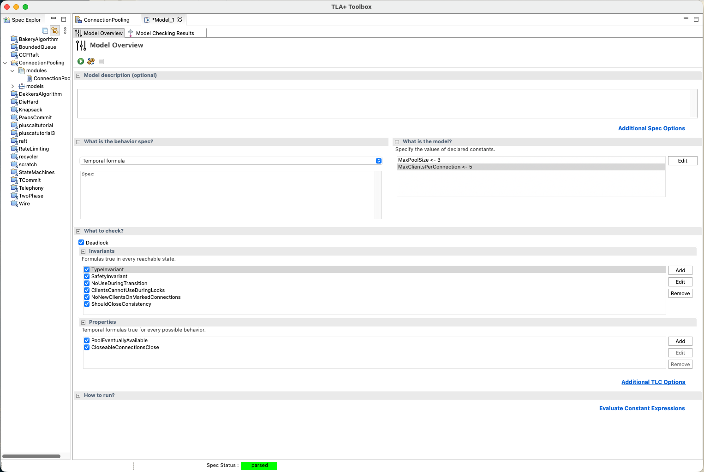

# TLA+ Specs

This directory contains specs for TLA+ to validate using the TLC model-checker.

TLA+ is a language for writing specs for asynchronous algorithms. Specs have been provided in order to validate our behavior satisfies expectations.

To run these, please download the TLC model checker and after loading the module, create a new model with a "behavior spec" of `Temporal formula` pointing to the `Spec` operator.

With in the "behavior spec" section, set the value of the constants to the following:

- `MaxPoolSize <- 3`
- `MaxClientsPerConnection <- 5`

Under "What to check?", consider the following safety properties:

